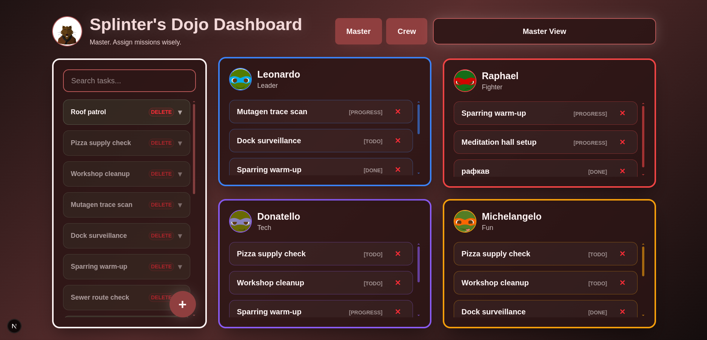
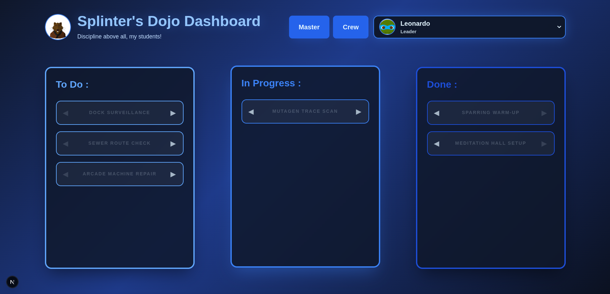

# TMNT Mission Control Center 🐢🍕

A specialized Task Management System for Master Splinter and the Teenage Mutant Ninja Turtles. Built with **Next.js 15**, **TypeScript**, and **Tailwind CSS**.

## 📸 Preview

**Master View:**


**Crew Dashboard:**


## 🛠 Architecture & "Clean Code" Approach

During the development, the project underwent a significant refactoring (the "grooming" phase) to ensure scalability and maintainability:

- **Logic Separation**: All business logic for the Master Panel is decoupled into a custom hook (`useMasterLogic.ts`), keeping the UI components lean.
- **Component Isolation**: Large UI elements like the `CreateTaskModal` are moved to separate files to improve readability.
- **Strict Typing**: Shared TypeScript interfaces in `lib/tasks.ts` and `lib/users.ts` act as a single source of truth for both Master and Crew views.
- **State Persistence**: Data is synchronized across different views using `localStorage`, allowing Master Splinter's assignments to appear instantly on the Turtles' personal dashboards.

## 🚀 Features

- **Master Dashboard**: 
  - Create missions with specific crew size requirements (`min`/`max`).
  - Assign specific Turtles to tasks.
  - Delete or modify backlog items.
  - Adaptive UI that changes themes based on the Master's (Splinter) color palette.
- **Crew Dashboard**: 
  - Personalized task views for each Turtle.
  - Kanban-style status updates (Todo → In Progress → Done).
  - Dynamic theme switching (the entire UI adapts its colors, glows, and scrolls based on the selected Turtle).
- **Keyboard Friendly**: Support for `Enter` to save and `Esc` to close modals.

## 📦 Tech Stack

- **Framework**: Next.js (App Router)
- **Language**: TypeScript
- **Styling**: Tailwind CSS
- **Icons/Avatars**: Custom assets & Emoji
- **State**: React Hooks (useState, useEffect) & LocalStorage

## ⚙️ Installation

1. **Clone the repository**:

        https://github.com/vladrbyte/kanban_tnmt.git

2. **Install dependencies:**
    
        npm install

3. **Run the development server:**

        npm run dev

4. **Open the app:**

        Navigate to http://localhost:3000


## Getting Started

First, run the development server:

```bash
npm run dev
# or
yarn dev
# or
pnpm dev
# or
bun dev
```

Open [http://localhost:3000](http://localhost:3000) with your browser to see the result.

You can start editing the page by modifying `app/page.tsx`. The page auto-updates as you edit the file.

This project uses [`next/font`](https://nextjs.org/docs/app/building-your-application/optimizing/fonts) to automatically optimize and load [Geist](https://vercel.com/font), a new font family for Vercel.


